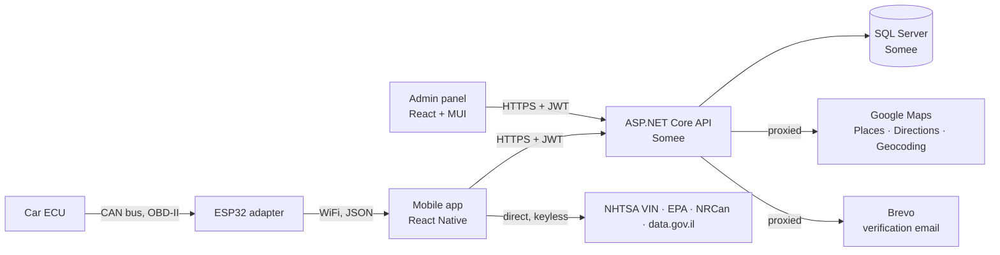

# CarStats

**An OBD-II car diagnostics platform for Israeli drivers.**

A fault code like `P0300` tells a driver nothing. CarStats reads the codes from the
car over a custom WiFi adapter, translates them into plain language with a severity
and a realistic repair price in shekels, and points the driver at the nearest garage.

The project is five parts: a React Native mobile app, an ASP.NET Core API, a SQL
Server database, a React admin panel, and ESP32 firmware that talks to the car's
CAN bus.

---

## The problem

Every car built since 2001 exposes a diagnostic port, and every fault it stores is a
five-character code. A driver who reads `P0420` on a generic scanner learns nothing
useful: not what is wrong, not whether it is safe to keep driving, and not what the
repair should cost. Commercial scanners either cost hundreds of shekels or hand back
the same raw codes.

CarStats closes that gap end to end — from the CAN bus in the car to a sentence a
driver can act on.

---

## Architecture



The phone never talks to the car directly. The ESP32 reads the codes over CAN and
serves them as JSON on the local network; the app fetches them and sends each one to
the API for translation.

---

## Repository layout

| Folder | What it is |
|---|---|
| `CarStats.Mobile/` | React Native app (Expo SDK 54, expo-router, TypeScript) |
| `CarStats.api/` | ASP.NET Core 10 Web API, EF Core, SQL Server |
| `CarStats.AdminWeb/` | React 19 + MUI admin panel (Vite), deployed to Netlify |
| `CarStats.ESP32/` | Arduino/PlatformIO firmware for the OBD-II adapter |
| `CarStats.PythonReports/` | Python reporting and dashboard scripts |
| `design/` | Design exports the UI was built against |
| `start-demo.bat` | One-click demo: boots the emulator, sets GPS, starts the dev server |

---

## Features

### Diagnostics
- **Live engine data** — RPM, speed, coolant temperature, engine load, fuel level,
  polled once per second from the adapter.
- **Fault scanning** — reads every active code, translates each through a curated
  dictionary of **34 codes** with severity, plain-language description, what to do,
  and a repair cost range in shekels.
- **AI fallback** — manufacturer-specific codes run into the thousands, so anything
  outside the dictionary is explained by Gemini, cached permanently per code, and
  always labelled as AI-generated.
- **Fault history** — every scan is recorded, deduplicated to one entry per code per
  day so an ongoing fault is not counted repeatedly.

### Fuel
- **Consumption tracking** — log fill-ups, get real L/100km instead of the
  manufacturer's lab figure. The computed average feeds the range estimate, the trip
  planner and the profile.
- **Running costs** — cost per 100 km weighted by distance, spend this month and this
  year, and the change against last month.
- **Cost to fill** — what a full tank costs at today's pump price.
- **Fuel type** — 95, 98 or diesel per vehicle. Only 95 is regulated in Israel, so
  the app marks the others as typical rather than official.

### Trip planning
- Route distance and live traffic from Google Directions.
- Fuel estimate that accounts for traffic **non-linearly** — idling burns far less
  than cruising, so the delay penalty is halved rather than applied in full.
- **"Will I make it?"** — compares fuel in the tank against the trip and, if short,
  says how many litres and how many shekels are needed. Only shown when the car
  reported its own fuel level, never from an estimate.

### Location
- **Mechanic finder** — live Google Places results, ranked nearest first, with real
  ratings, Hebrew names, straight-line distance, one-tap call and directions.
- **Child safety reminder** — a 150 m geofence around home. Arriving fires a
  "check the back seat" notification, handled by the operating system so the app can
  be closed entirely.

### Accounts
- Registration with emailed verification codes, JWT sessions, role-based access
  (User / Admin / SuperAdmin), and an admin panel for users, vehicles and the fault
  dictionary.

---

## Engineering decisions worth reading

These are the parts where the interesting work is.

**Fault counts are derived, not stored.** A scan reports every code at once, so three
faults arrive as three concurrent requests. A stored counter loses increments to the
lost-update race — and once wrong it can never recover, because deduplication stops
any later scan from correcting it. The count is now a `COUNT` over the events, so it
cannot disagree with the history screen.
→ `Controllers/UsersController.cs`

**Google keys never reach the phone.** All Maps calls go through the API's
`/navigation` proxy. Two reasons: Google's web services send no CORS headers, and a
key in the client bundle can be extracted and spent by anyone.
→ `Controllers/NavigationController.cs`

**The geofence lives with the OS, not the app.** The app registers a circle once and
Android does the watching, escalating from cheap cell-tower positioning to GPS only
near the boundary. The app never polls location, which is what makes it viable on
battery.
→ `services/notifications.ts`

**Deleting a vehicle keeps its history.** Fault events are detached rather than
deleted, so a user's timeline survives selling the car.
→ `Controllers/VehiclesController.cs`

**Fuel pump prices are served, not compiled in.** Israel's Ministry of Energy revises
the regulated 95 price monthly. A constant in the app could only be corrected by
shipping a new build, so the price comes from server config with a dated fallback.
→ `Controllers/FuelPriceController.cs`

**Arithmetic lives in pure functions.** Fuel estimation, trip outlook, cost per 100 km
and severity folding are all in `utils/`, with no network or storage, so every edge
case is unit-tested without rendering a component.
→ `utils/fuel.ts`, `utils/severity.ts`

**Cars that cannot report fuel level.** Many vehicles do not support OBD-II PID `0x2F`.
The driver sets a baseline once and the level is inferred from distance driven and
consumption, with guards so a missing tank size cannot divide by zero and slam the
gauge to empty on a full car.
→ `utils/fuel.ts`

---

## External services

| Service | Called by | Key | Why |
|---|---|---|---|
| Google Directions | API | server | Route distance + live traffic |
| Google Places | API | server | Mechanics, autocomplete, phone numbers |
| Google Geocoding | API | server | Home address → coordinates |
| Brevo | API | server | Verification emails |
| NHTSA vPIC | App | none | VIN → make/model/year |
| fueleconomy.gov | App | none | Year → make → model → trim, EPA consumption |
| NRCan open data | App | none | Consumption fallback for non-US models |
| data.gov.il | App | none | Israeli licence-plate lookup |
| Google Gemini | App | free tier | AI fault explanations |

Anything with billing attached is proxied server-side. Gemini is the exception — a
free-tier key with a daily cap, so the worst case is exhausted quota rather than a
bill. Proxying it would be the correct next step.

---

## Security

- Passwords hashed with **BCrypt**, never stored or logged in plain text.
- **JWT bearer** authentication; every endpoint authorises the caller, and
  `CanActFor` ensures a user can only act on their own data unless they are an admin.
- Email verification required before a session is issued. Codes expire, wrong guesses
  are capped at five, and resends are rate-limited.
- Secrets live in gitignored server config — `.env` and `appsettings.Production.json`
  are **never** committed. The repository and its full history contain no real keys.
- Home addresses are stored **only on the device**. There is no location column in the
  database, so a home address never leaves the phone.

---

## Testing

**82 unit tests** across six suites, run with `jest-expo`:

```bash
cd CarStats.Mobile/CarStats.Mobile
npm test
```

| Suite | Covers |
|---|---|
| `fuel.test.ts` | Fuel estimation, fill-up cost, running costs, trip outlook |
| `severity.test.ts` | Severity mapping and folding a scan to its worst fault |
| `vindecode.test.ts` | VIN parsing and vehicle matching |
| `fueleconomy.test.ts` | Consumption lookup chain |
| `password.test.ts` | Password policy |
| `routeErrorMessage.test.ts` | Route failure messages |

The tests target pure functions deliberately — the arithmetic that drives the gauges
and the cost estimates, where a wrong answer is silent rather than obvious.

---

## Running it

### Mobile app
```bash
cd CarStats.Mobile/CarStats.Mobile
npm install
cp .env.example .env      # add a Gemini key for AI explanations
npm start
```

Or run `start-demo.bat` from the repository root, which boots the Android emulator,
fixes its GPS to Hadera, starts the dev server and opens the app.

The app points at the deployed API by default, so no local backend is needed.

### API
```bash
cd CarStats.api/CarStats.API
dotnet run
```

Uses LocalDB in development. Migrations and dictionary seeding run automatically on
startup, wrapped in a retry loop because a free shared database can be briefly
unavailable on a cold start.

### Admin panel
```bash
cd CarStats.AdminWeb/CarStats.AdminWeb
npm install && npm run dev
```

### Demo mode
The app has a built-in demo connection that simulates the adapter, so the whole
diagnostics flow can be shown without the ESP32 hardware present. It is always
user-initiated and clearly labelled on screen as simulated.

---

## Known limitations

Stated plainly, because they are design boundaries rather than oversights.

- **Only 95-octane fuel has an official price.** Israel deregulated the rest in 2007,
  so 98 and diesel are typical figures the driver is expected to check.
- **Tank capacity is typed by the user.** No vehicle database publishes it.
- **The manual add-vehicle flow is EPA-based**, so it only lists US-market models. The
  licence-plate flow covers Israeli cars via the government registry.
- **The traffic fuel penalty is a model assumption**, not a measured constant.
- **Distances to garages are straight-line**, not driving distance. Enough to rank
  them; the directions button hands real routing to Google.
- **Background location is unavailable in Expo Go**, so the geofence cannot fire
  during a demo. Settings includes a preview button that triggers the notification
  directly.

---

## Stack

**Mobile** — React Native 0.81, React 19, Expo SDK 54, expo-router, TypeScript,
react-native-paper, react-native-maps, expo-location, expo-notifications,
expo-task-manager, AsyncStorage, axios, Jest

**API** — ASP.NET Core 10, EF Core 8, SQL Server, BCrypt.Net, JWT bearer, Swashbuckle

**Admin** — React 19, MUI 9, Vite, axios

**Firmware** — ESP32, TWAI (CAN) driver, ArduinoJson, WebServer

**Hosting** — API and database on Somee, admin panel on Netlify
